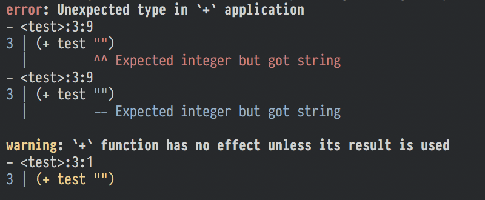

# codespan

[![Build Status][travis-badge]][travis-url]
[![Crates.io][crate-badge]][crate-url]
[![Docs.rs][docs-badge]][docs-url]
[![Gitter][gitter-badge]][gitter-lobby]

[travis-badge]: https://travis-ci.org/brendanzab/codespan.svg?branch=master
[travis-url]: https://travis-ci.org/brendanzab/codespan
[crate-url]: https://crates.io/crates/codespan
[crate-badge]: https://img.shields.io/crates/v/codespan.svg
[docs-url]: https://docs.rs/codespan
[docs-badge]: https://docs.rs/codespan/badge.svg
[gitter-badge]: https://badges.gitter.im/codespan-rs/codespan.svg
[gitter-lobby]: https://gitter.im/codespan-rs/Lobby

Utilities for dealing with source code locations and pretty printing diagnostics.

## Running the CLI example

To get an idea of what the colored CLI output looks like with
`codespan`, clone the repository and run the following:

```sh
cargo run --example=term
cargo run --example=term -- --color never
```

You should see something like the following in your terminal:



We're still working on the output - stay tuned for updates!

In the future we would also like to make it easy for language developers to set
up language server protocols and interface with browser-embedded editors like
Ace or Monaco.

## Running the CLI example

To get an idea of what the colored CLI output looks like with
`codespan-reporting`, clone the repository and run the following:

```sh
cargo run -p codespan --example=term
cargo run -p codespan --example=term -- --color never
```

You should see something like the following in your terminal:


We're still working on the output - stay tuned for updates!

## Codespan in use

Codespan is used in the following projects:

- [Gluon](https://github.com/gluon-lang/gluon)
- [Pikelet](https://github.com/pikelet-lang/pikelet)
- [Gleam](https://github.com/lpil/gleam/)
- [Arret](https://arret-lang.org)

## Acknowledgments

Inspired by [rustc's error reporting infrastructure][libsyntax], the [codemap][codemap]
crate, and [language-reporting][language-reporting] (a fork of codespan).

[libsyntax]: https://github.com/rust-lang/rust/tree/master/src/libsyntax
[codemap]: https://crates.io/crates/codemap
[language-reporting]: https://crates.io/crates/language-reporting
